**English** | [Русский](README.ru.md)

# My take on turning a 27" 5K iMac into a monitor.

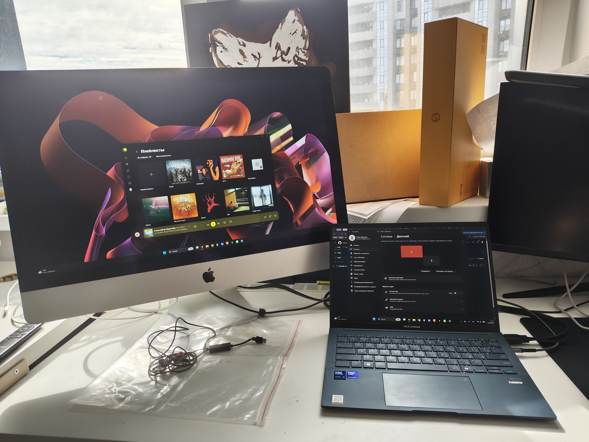

I've wanted a proper display for a long time — something like the Studio Display — but those cost a fortune, and you can't just use a regular iMac as a monitor. So there's a community that converts these Macs into monitors with kits from Stonetaskin.

People used to do this on the r1811 board; there's plenty of info on that one. Then the upgraded r1820 came out with better ports, and there's basically nothing written about it. That's the one I went with: with the crossover, using the original Mac fan, and keeping the outside as clean and hidden as possible.

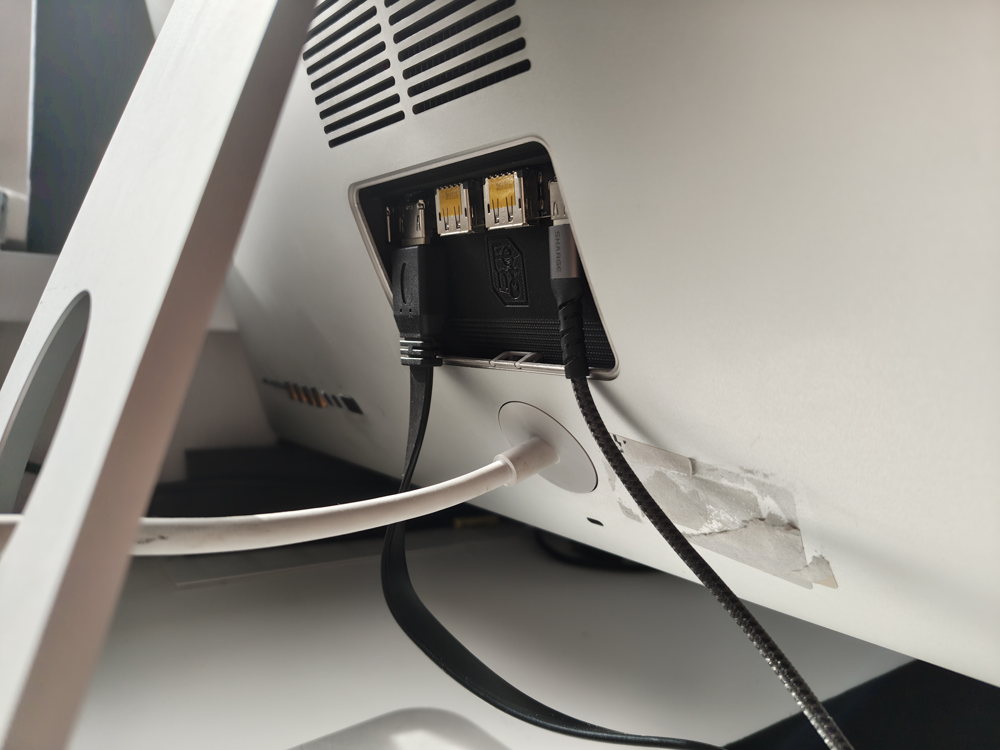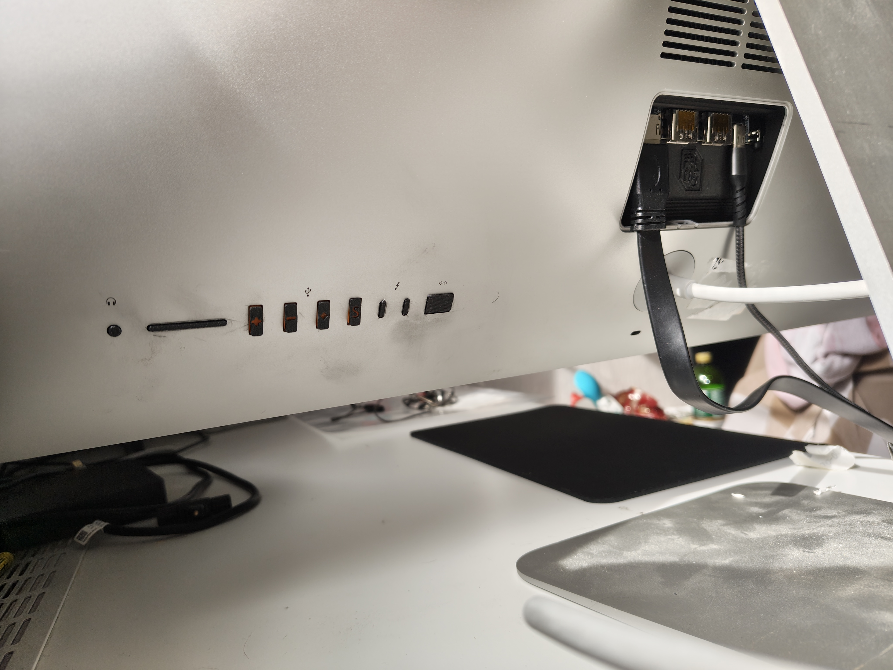

Everything works, and the rear cover still closes. The only sacrifice was the ports — what's left accessible:

**1x HDMI 2.1**

**2x DP 1.4**

**USB-C PD 65w**

**3.5 jack.**

### The project is open source. Tips welcome: **USDT TRC-20** `TH4Sh4Cd2GvSHoK5rmMDNXLLsbGfnbpSu3`

**By the way, if you're a student, staff member, or resident of School 21's Moscow campus, come by our lab. We'll give you consumables and tools, and we'll help you out. Also join our [Telegram](https://t.me/mos_21lab) group — that's the easiest way to reach me.**

> **Disclaimer 1** - The author is not responsible for inaccuracies, mistakes, problems, or anything of that sort. Check everything yourself, double-check, and do this at your own risk. You're not kids anymore.

> **Disclaimer 2** - This project requires soldering/desoldering skills and knowing how to use a multimeter.

## Let's start with shopping — here's what you'll need:

### 0. iMac 27" Retina 5K. Mine is specifically a 2017.

### 1. [Stonetaskin r1820. The largest kit (Package C), fanless](https://www.stonetaskin.com/products/stonetaskin-latest-5k-lcd-driver-board-r1820-v1-0-for-imac-27-lm270qq1-lm270qq2-hdmi-2-1-dp-1-4-usb-3-0-upgrade-diy-5k-monitor?variant=47057182392474)

**P.S** - As far as I know, every iMac uses an LM270QQ1 display connector. Still, verify which one you actually have. On the back of the panel there's a black sticker with the model number.

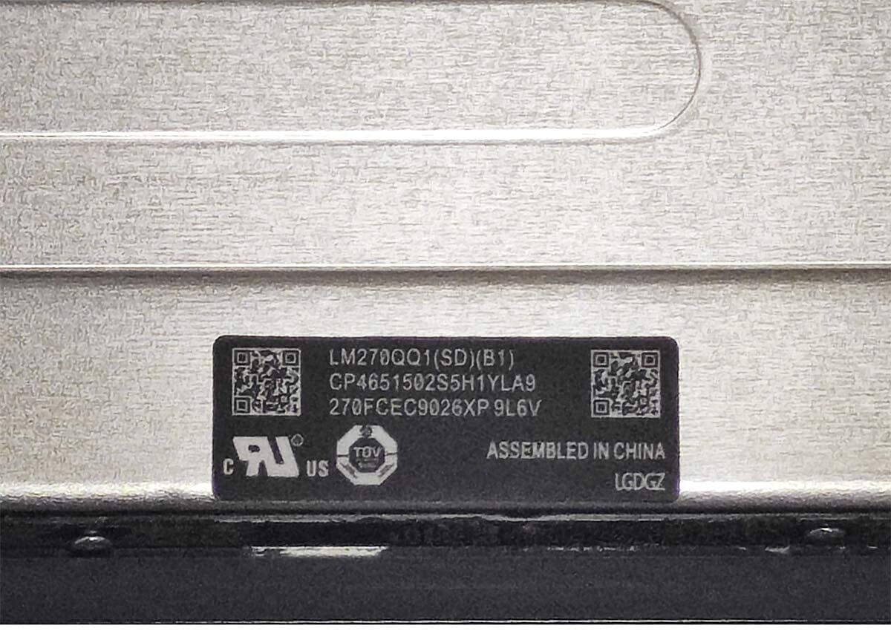

**P.S.S** - Looks like you can order from the site with shipping to Russia. Sometimes it shows up on AliExpress. You can buy the crossover separately, but definitely get it with the included 24V PSU — otherwise you'll have to remodel the mount for a different one.

**P.S.S.S** - Get the fanless version, because you'll have to toss the included fan anyway. On this board, unfortunately, the fan spins at full blast from the moment you power on, and we'll have to fix that ourselves.

### 2. Repair kit for iMac 27"

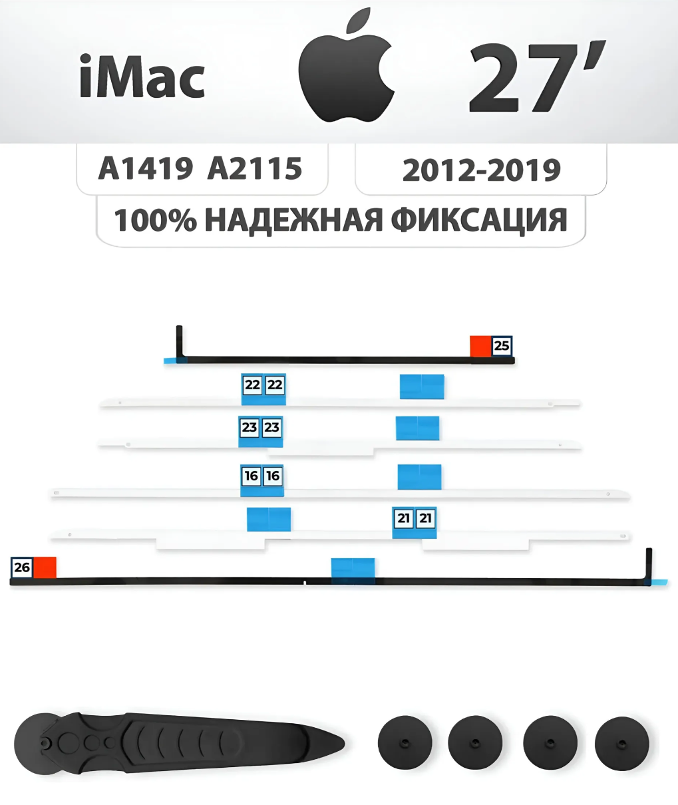

Looks roughly like this. Get one that includes the knife — it makes it much easier to unstick the panel.

### 3. PWM fan controller with a temperature sensor

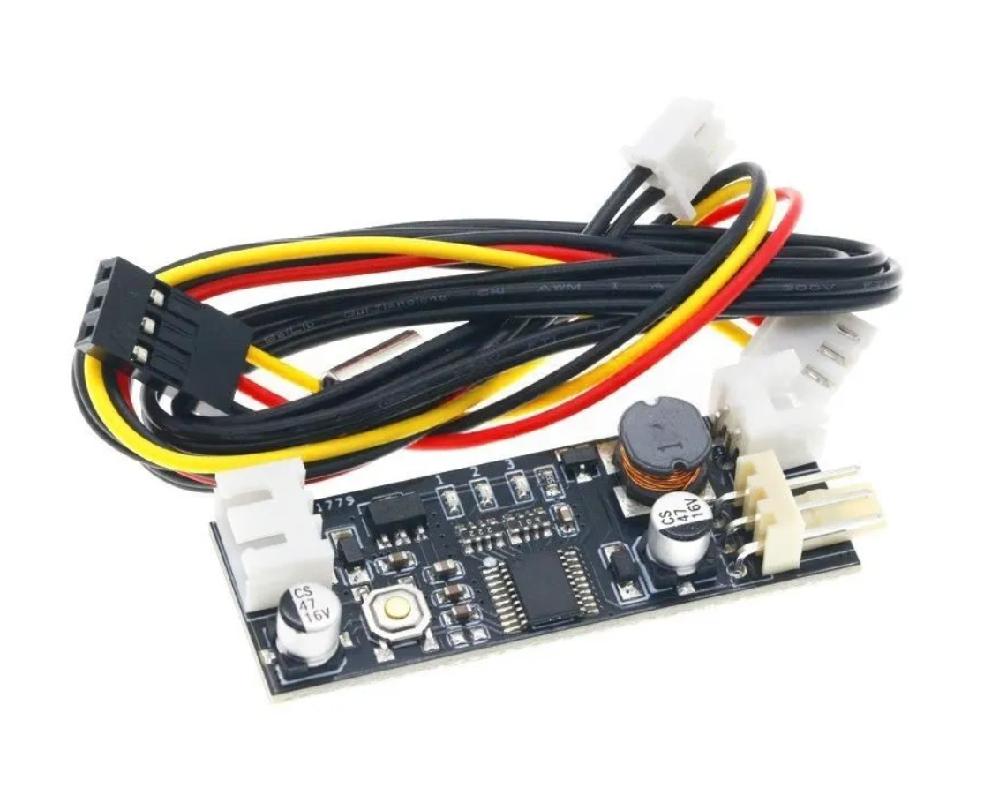

As I said earlier, the board itself cannot control fan speed. The controller we need looks like this.

### 4. Kafuter silicone adhesive/sealant

Used for insulating exposed contacts, gluing things together, assembling parts, and so on. Glue everything with it — the goal is that once the panel is back in, nothing rattles around inside the monitor.

### 5. Silicone (or whatever you can find) wire. 26-30 AWG. Ideally 3–4 colors so you don't mix them up.

### 6. Heat shrink tubing kit

### 7. Reinforced tape, electrical tape, zip ties.

## Tools you'll need:

1. Soldering iron, hot air gun, and all the usual extras.
2. Set of small screwdrivers.
3. Cutters, utility knife.
4. 3D printer. PETG filament preferred.
5. XH 2-pin and 3-pin connectors with a crimper, ideally. If you don't have one nearby, you can solder directly.

# Alright, if you've got everything together, time to start!

## 1. Disassembling the iMac

Disassembly guide is on [iFixit](https://www.ifixit.com/Device/iMac_27%22_2017)

Tear it down to this state (remove the fan too). Make sure you removed the original headphone jack.

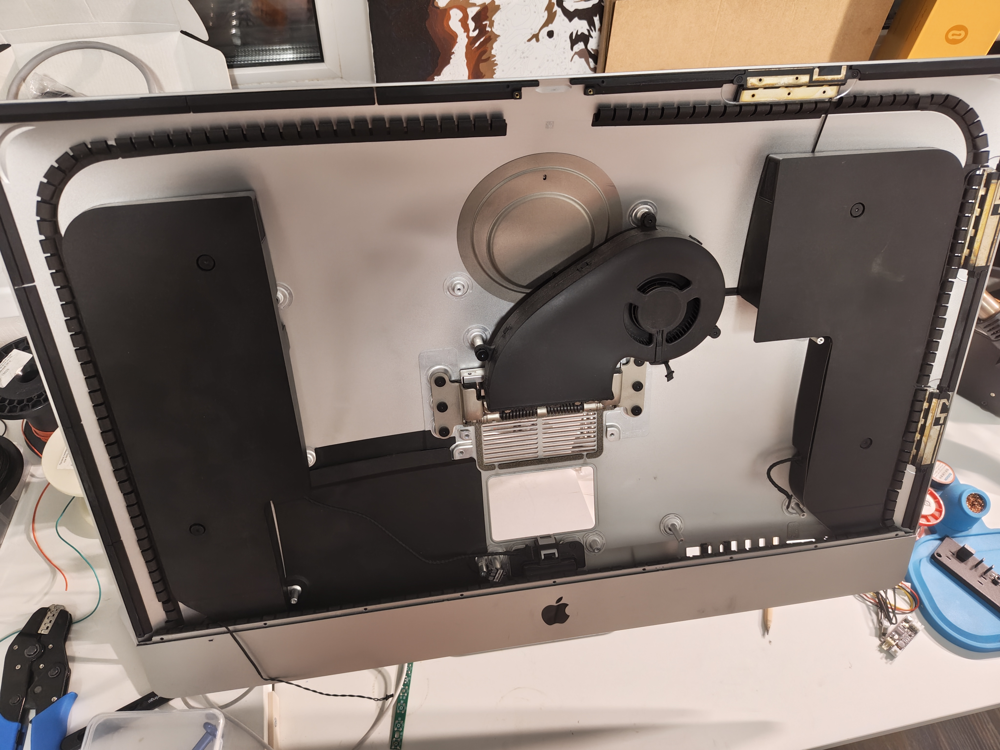

For the rest of the build we'll need these screws. The silver ones go to the main structure, and the short black ones with a wider head go to the button block.

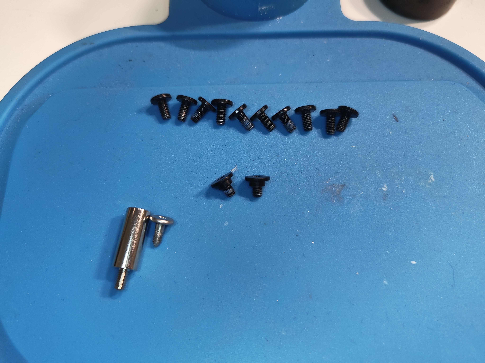

## 2. Building the button block

You need to desolder the buttons, the LED (very fragile!), and the IR receiver from the Stonetaskin button board.

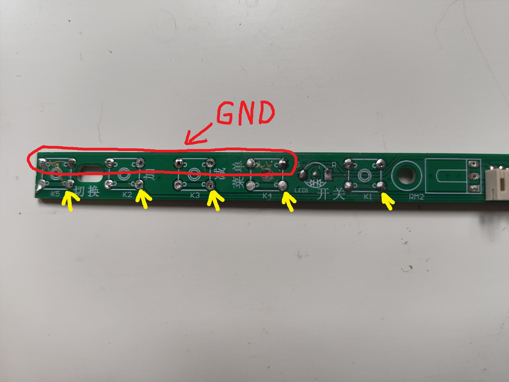

Install mainBody. Silver standoff on the left, silver screw on the right.

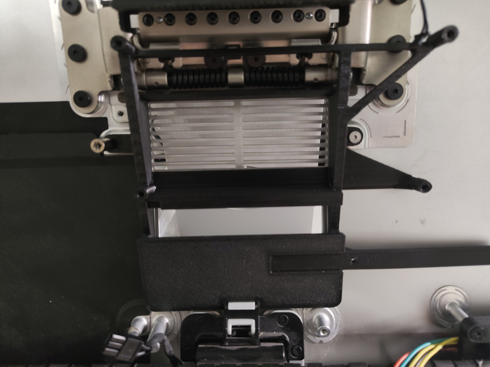

Screw the board onto the mainBody part after desoldering. The connector should be on the left.

You also need to extend the wires of the original power button, which is on the left. Find its cable — a black 2-wire one — cut off the connector and extend the wires roughly to where the board is installed.

Then mount the buttons on the keyBody part. Don't forget to snip the unused legs and glue the buttons to the part.

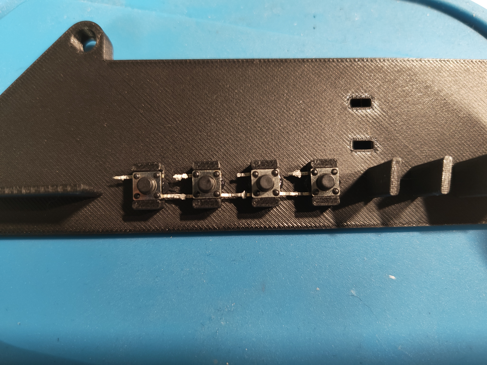

The original buttons are pretty noisy; if you want, you can swap them for quieter ones, but they have to match in height and mounting position.

Join the bottom legs and solder the wires: one wire to each top leg + one wire to the bottom row of legs. Secure with zip ties.

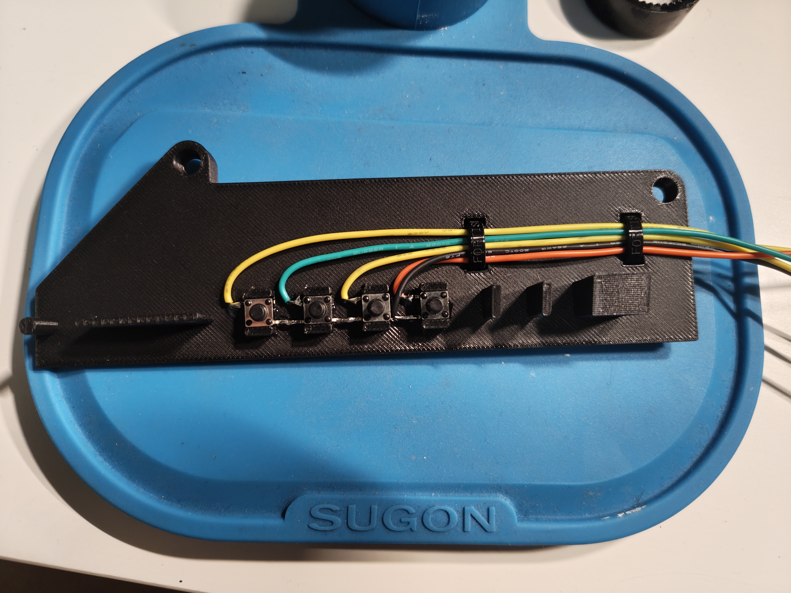

Then the fun part. Drop the printed keycaps into the USB port holes. Pick the order yourself, however it's convenient — just remember which button does what. After that, test-fit the button assembly in place. The plugs on the part should go into the unused holes in the chassis.

Don't fully tighten the screws! Check that the buttons actually press. If they don't press or they bind, adjust by tightening the screws, or you can touch up the buttons with a soldering iron.

After it's installed, you can solder the button wires to the board you desoldered them from. Button functions:

- K1 - ON/OFF switch
- K3 - Volume/menu up
- K2 - Volume/menu down
- K4 - Menu
- K5 - Signal source

The wire from the bottom row of our assembly + either of the two wires from the power button you extended — solder those to the board's GND (shown in the photo above). The remaining wires get soldered according to their function (where I pointed with the yellow arrows)

## 3. Assembling CameraReplacement

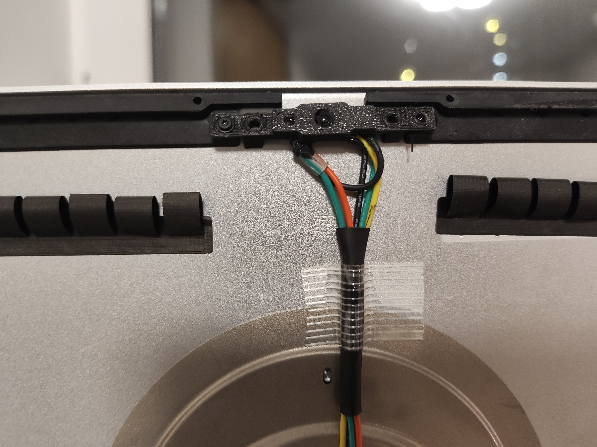

Glue the IR receiver and the LED into the CameraReplacement part (if they don't fit — soldering iron time). The center contacts of the LED and the receiver can be tied together — that's GND. Solder the remaining wires and run them to the button board. Try to assemble it so that the original tiny camera screws still go in when you install it. If they don't thread in, you can trim the plastic ledges around the heat-set nut with a knife.

For soldering — figure out which LED anode is which color (with a multimeter) and solder it to the matching pad on the board (the footprint is labeled R and G). Figure out the IR receiver pins (on the board the receiver was mounted lens-up) and solder them to the same places. The finished soldering should look roughly like this

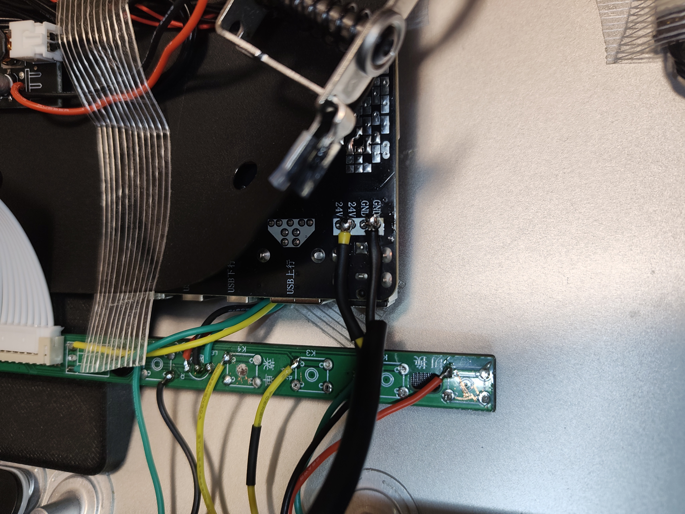

## 4. Preparing and installing the PSU

Take apart the PSU case and desolder the mains inlet. Strip some mains cable (the included one is fine) into individual conductors (brown, blue, yellow-green). Solder them to the inlet pads on the board (L — live — brown, N — neutral — blue). It's also highly recommended to get a wire with a ring terminal (or crimp one onto a conductor you pulled), solder it to the ground pad, and screw the ring under the standoff where the iMac's mains inlet ground already sits (somewhere near the inlet connector). Cut off the iMac inlet connector and solder it to the PSU wires. **Don't forget the heat shrink!**

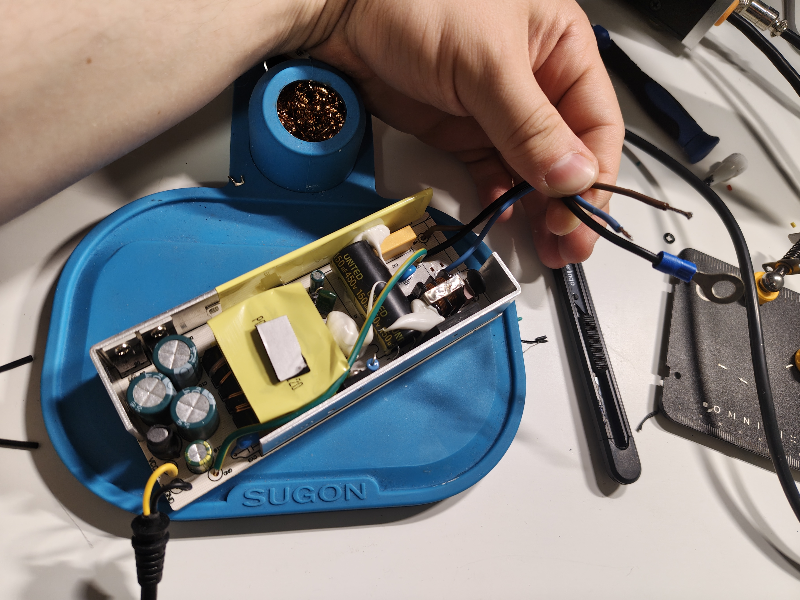

Install the PSU into the additionalBody part, after putting sealant on the pads that hold the PSU in the part. Install the assembly in place, to the left of mainBody, and screw the part to the iMac (one of the screws goes into the silver standoff).

## 5. Preparing and installing the crossovers

Desolder all the screw terminals from the crossovers and solder the wires that were clamped in them to the same pads. After soldering, put sealant over the joints.

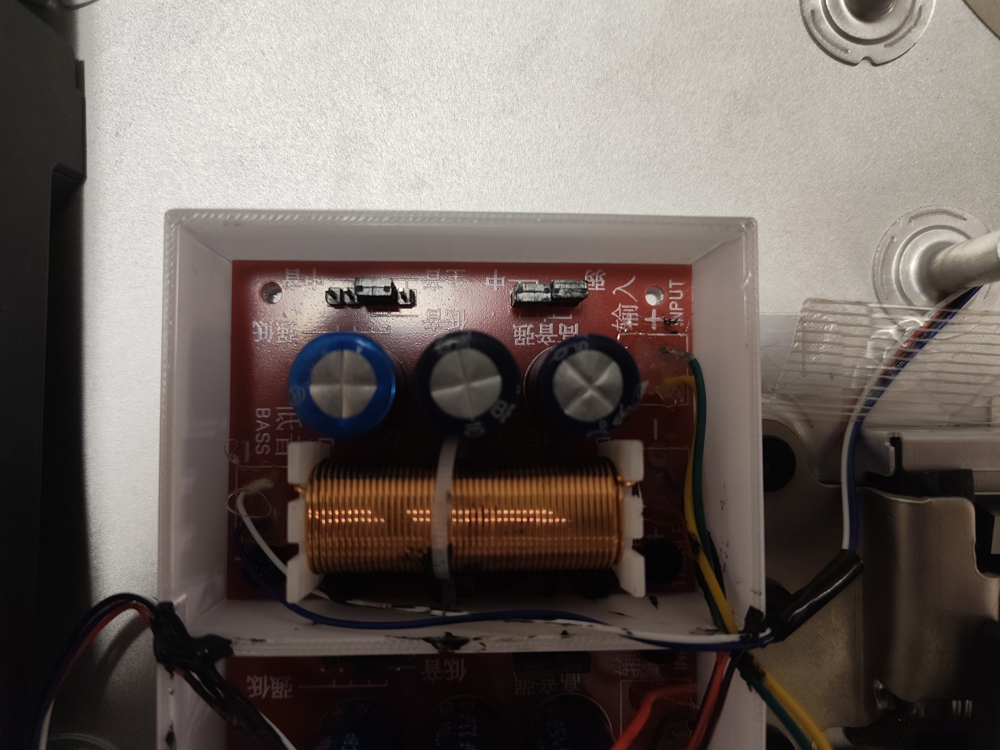

Set the jumpers as shown in the photo. Get this wrong and the speakers won't work.

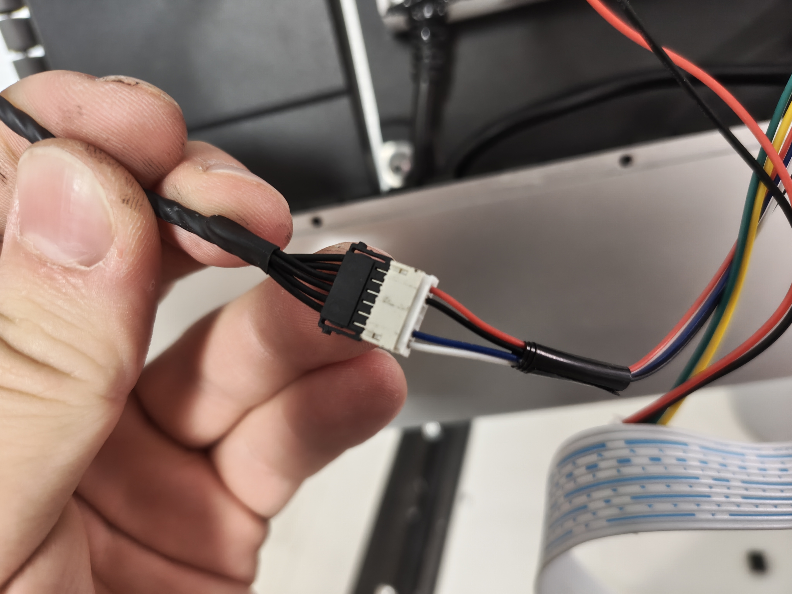

Connect to the iMac speakers as shown in the photo.

To tell which crossover is which speaker, plug the 4-wire connector into the board (Power Amplifier Interface). Here's where everything connects

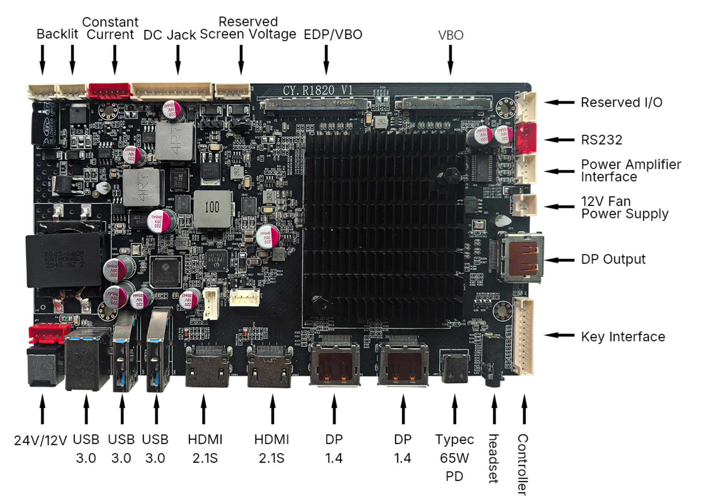

On the bottom of the board, under the black plastic cover, the connector is labeled R+, R-, L+, L-. While you're at it, check that none of the pairs have swapped polarity — i.e. visually follow a wire, say R+, to the crossover. If it goes to the '-' terminal, polarity is reversed. You can fix this: carefully pull the swapped pair of contacts out with tweezers while lifting the plastic latch on the housing, then insert them in the correct order.

Once you've checked all the connections, put the crossovers in place. If they're a tight fit — sand the boards around the outline. Screw them down; two screws per crossover is enough. It should look roughly like this.

Place the r1820 on its mounting spot. Measure the PSU output cable (the one with the barrel DC connector) to the r1820 connector (bottom right, above button K2 on the button board you installed earlier). Cut it with a little slack and solder it to the board. Example is in the photo from section 3. Assembling CameraReplacement.

## 6. Preparing and installing the fan

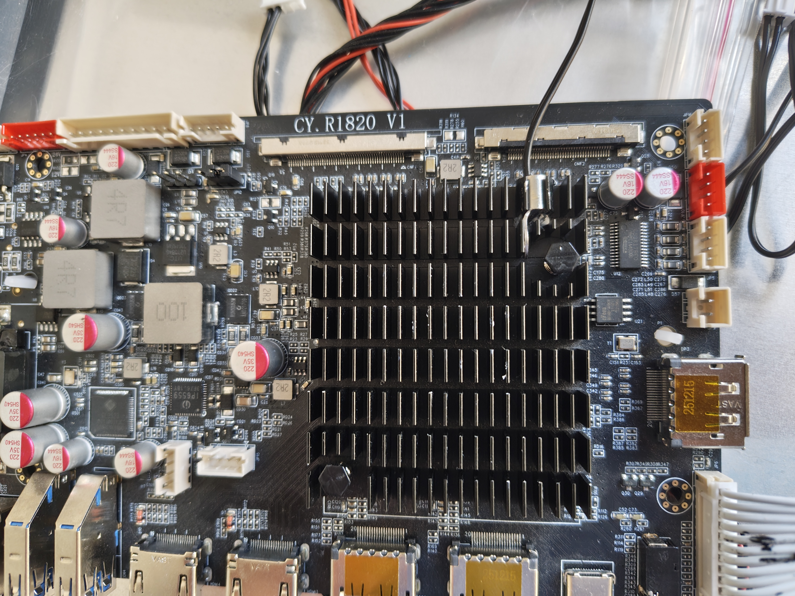

On the r1820, carefully break off one of the fins on the heatsink. Put the temperature sensor from the PWM controller kit into the gap. If you have thermal paste, put some under the sensor. Then squeeze the neighboring fins with pliers so the sensor is held on the heatsink, as in the photo.

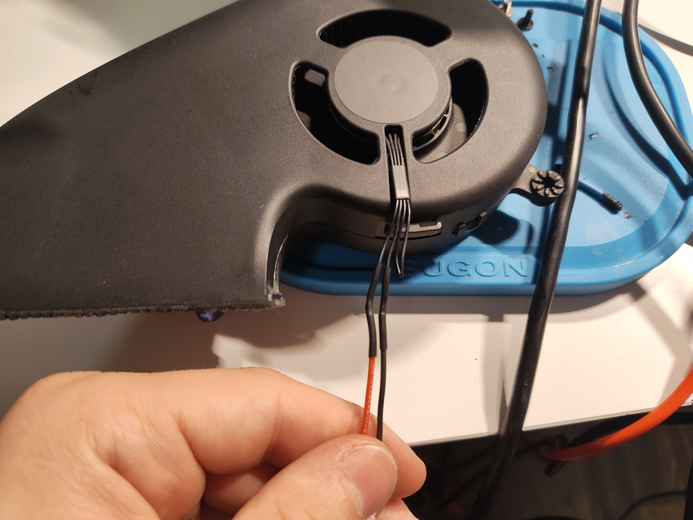

Pull the fan connector out of the clips and cut it off. Solder two wires as shown in the photo.

On the PWM controller, desolder the fan connector and the power connector (if you don't have a crimper). You'll also need to desolder the 12v Fan Power Supply connector on the r1820 if you're going without crimping your own connector. Solder the fan to the PWM controller, and the PWM controller's power to the 12v Fan Power Supply pads on the r1820. Also plug the temperature sensor into the controller.

Now it's important to set the fan's idle speed. This controller has a somewhat confusing setup, so I'll describe how I did it. Power the r1820 from the PSU. The fan should start spinning right away, and one LED on the board will be on. As far as I can tell, you need to switch the controller to mode 2. Hold the button until the LED starts blinking. Then press once — the second LED should light up. Hold the button until the LED starts blinking fast — that's apparently saving the settings. Now we can set the idle speed. In normal mode, when the second LED is solid, a single press raises the speed, a double press lowers it. I set it so the fan barely moves when there's no heat.

In theory the controller is configured now. You can check by power-cycling. To verify the fan reacts to heat, point a hot air gun at the temperature sensor.

## 7. System check.

Before putting everything together, make sure it all works.

1. Power should already be soldered.
2. Buttons, status LED, and IR receiver are soldered to the original board. The original button board is connected to the r1820 with the white ribbon to the Key Interface connector.
3. Crossovers are connected to the speakers. Plug the 4-pin connector into the r1820 Power Amplifier Interface.
4. Display connector is connected to the panel and to the r1820 EDP/VBO socket.
5. The backlight ribbon is connected to the display connector as in the photo

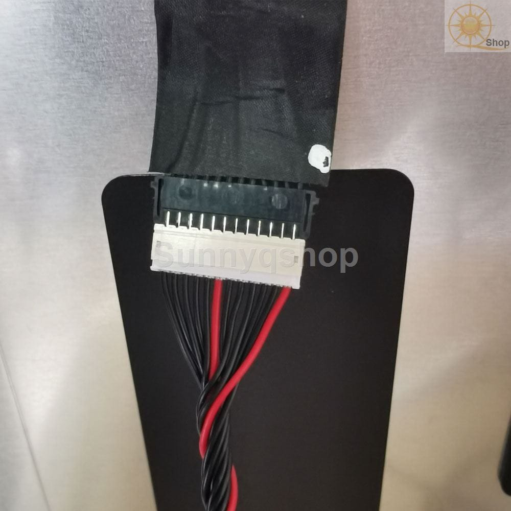

Connected to the r1820 as follows

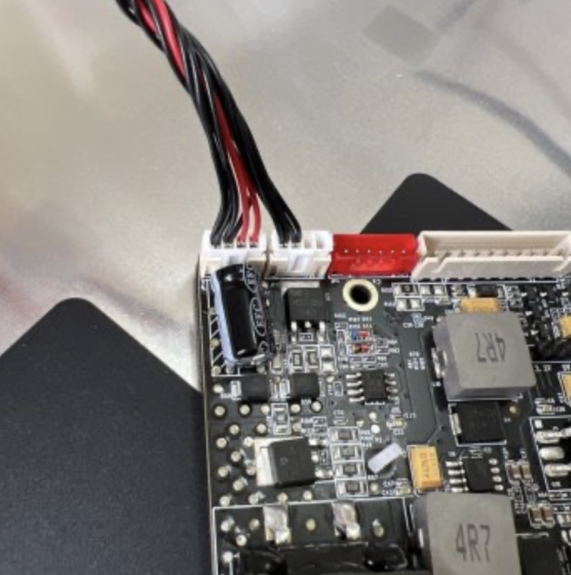

Before applying power, check every connection yourself! Google how things are wired on the r1811 — the hookup is similar.

After applying power, connect to the display any way you like. The LED should light up, you should get a picture, sound, and the buttons should do their thing (make sure they aren't swapped). Also test the remote (never press the FLIP button!).

## 8. Final assembly

**Congrats**, you've reached the final assembly stage. The main thing here is to mount everything securely, tie down all the wires, and not break anything. Grab a friend — installing the panel is easier with two people.

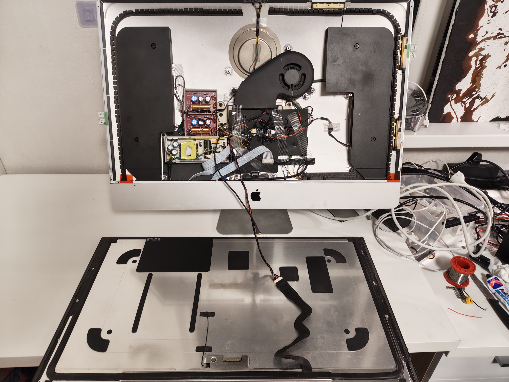

1. Disconnect power!
2. Unplug the connectors from the display (it'll be awkward to put everything back with them attached)
3. Install the board (everything should already be connected to it) onto its mounting spot. It will be a very tight fit, especially because of the button ribbon. Screw the board down with 4 screws.
4. Install the fan. The display connector should tuck into it a little — that's normal.
5. Finally secure anything that's loose with tape and sealant. Tape may come off over time; sealant will hold firmly once it cures.
5. Apply new double-sided tape from the repair kit (don't forget to fully remove the old stuff!).
6. Rest the display's bottom edge against the iMac chassis. Plug in the display connector.
7. Once you're sure you haven't forgotten anything, press the panel on around the entire perimeter.

# **Congratulations! You now have a real Hackintosh Studio Display!**
